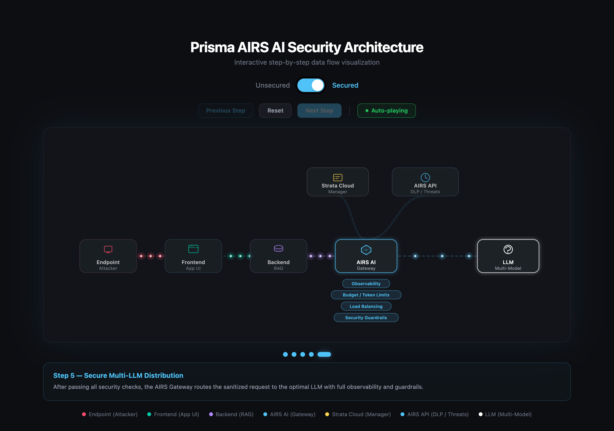

# Prisma AIRS AI Security Architecture

Interactive step-by-step SVG visualization of the Prisma AIRS AI Security data flow.



## Features

### Architecture Diagram
- **Two scenario modes** — compare unsecured vs. secured AI request paths
- **Step-by-step walkthrough** with auto-play, Previous/Next/Reset controls
- **Animated SVG particles** flowing along data paths in real time
- **Clickable nodes** that jump to relevant steps
- **Risk & capability badges** highlighting security gaps and AIRS gateway features

### AI Chatbot (RAG-backed)
- **Right-side chat panel** powered by [Portkey AI gateway](https://portkey.ai)
- **Retrieval-Augmented Generation** — answers are grounded in internal documents only; unrelated questions return `"Unable to access internal data."` without calling the LLM
- **Configurable connection** — click the gear icon (top-right of chat panel) to set the Portkey base URL, API key, provider slug, and model name; settings persist in the browser
- Default gateway: `https://aigw.portkey.ai/v1`, model: `gpt-4-1-mini`

### Knowledge Base Admin
- **Admin panel** (lock icon, bottom-left corner) for managing internal documents
- Password-protected; create, edit, and delete documents across all folders
- **Extensible folders** — add new categories (e.g. `employees`, `finance`) beyond the three defaults
- Seed documents cover HR policy, leave entitlements, expense policy, reimbursement guide, password reset, and IT helpdesk — all set in the fictional company **PAN Technologies** (`pan.com`)
- Documents are stored in `localStorage` (never served as public files)

## Tech Stack

- React 19 + TypeScript
- Vite 8
- Tailwind CSS v4
- Portkey AI gateway (chat completions)

## Prerequisites

- **Node.js >= 20.12** (Vite 8 / Rolldown requires `node:util.styleText`, added in Node 20.12)

## Getting Started

```bash
npm install
npm run dev
```

## Production Deployment

```bash
npm run build
npm start
```

This builds the app to `dist/` and serves it on port 4173 (bound to `0.0.0.0`). To run as a systemd service, point `ExecStart` at `npm start` in the project directory.

## Scripts

| Command | Description |
|---------|-------------|
| `npm run dev` | Start dev server (port 5173) |
| `npm run build` | Production build (outputs to `dist/`) |
| `npm start` | Serve production build (port 4173, all interfaces) |
| `npm run lint` | Run Oxlint |
| `npm run preview` | Preview production build (localhost only) |
