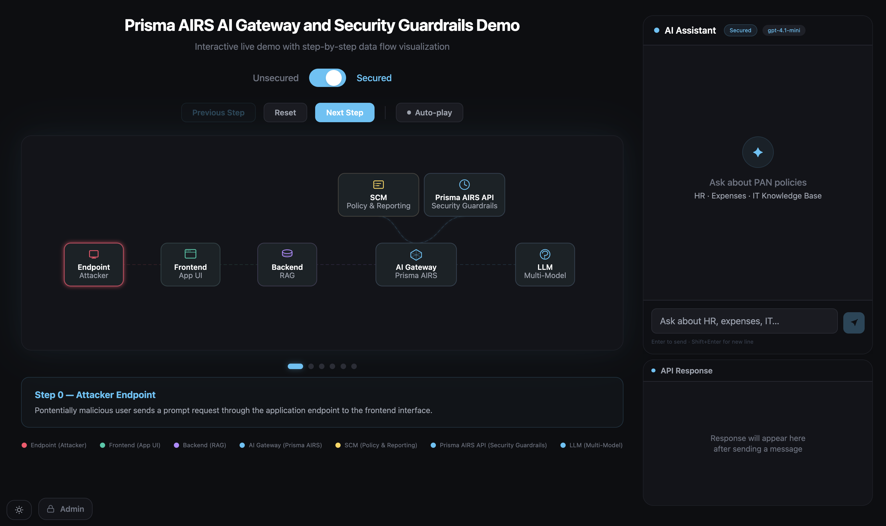

# Prisma AIRS AI Gateway and Security Guardrails Demo

Interactive live demo with step-by-step SVG visualization of the Prisma AIRS AI Security data flow, with a live RAG-backed AI chatbot that demonstrates secured vs. unsecured AI request paths.



## Features

### Architecture Diagram
- **Two scenario modes** — compare unsecured vs. secured AI request paths side-by-side
- **Step-by-step walkthrough** with auto-play, Previous/Next/Reset controls
- **Live node highlighting** — nodes and edges animate in sync with real chat events (typing, sending, receiving)
- **Animated SVG particles** flowing along data paths in real time
- **Clickable nodes** that jump to relevant steps
- **Risk & capability badges** highlighting security gaps and AIRS gateway features
- **Light/dark mode** toggle (bottom-left)

### AI Chatbot (RAG-backed, dual-mode)
- **Right-side chat panel** that mirrors the active diagram mode:
  - **Secured mode** → routes through [Portkey AI gateway](https://portkey.ai) with AIRS inspection
  - **Unsecured mode** → calls the LLM directly with a Bearer token
- **Retrieval-Augmented Generation** — answers are grounded in internal documents only; unrelated questions return `"Unable to access internal data."` without calling the LLM
- **Block detection** — when the AIRS gateway blocks a request or response, the message bubble displays a specific reason derived from `hook_results` (e.g. "your query contains prompt injection context", "the response contains sensitive data"); falls back to a generic gateway-blocked message if no specific flag is matched
- **Clear button** — header button clears the chat history; only visible when messages exist
- Default model: `gpt-4.1-mini`

### API Response Inspector
- **Collapsible JSON tree** below the chat panel (30% of right-column height) with syntax highlighting: keys, strings, numbers, booleans, and null each have distinct colors
- First two levels auto-expanded; deeper nodes start collapsed and show item/key count
- Shows the full response from the last LLM or gateway call, including AIRS `hook_results`
- **View Report ↗** button appears when a `session_id` is present in the response, linking to Strata Cloud Manager for the full AI session audit

### Admin Console
- **Unified admin panel** (bottom-left, opens with a button)
- Login with username + password (configured in `.env`; additional users manageable in the panel)
- **Three tabs after login:**
  - **Chat Settings** — configure Portkey gateway (base URL, API key, provider, model, SCM Report URL) and Direct LLM (base URL, bearer token, model); settings saved server-side and persist across browsers
  - **Knowledge Base** — full CRUD for internal documents: create/edit/delete files and folders
  - **Users** — add, remove, and change passwords for additional admin accounts (email as username); passwords are hashed server-side and never stored in plain text
- **Auto-reload on save** — closing the panel after saving Chat Settings reloads the page so the chat picks up the new config immediately; no manual refresh needed
- Session persists in `localStorage`; no re-login needed until logout

### Knowledge Base
- Documents stored in `data/rag.json` on the server (never exposed as public files)
- **Extensible folders** — add new categories beyond the three defaults (`hr`, `expense`, `kb`)
- Seed documents cover HR policy, leave entitlements, expense policy, reimbursement guide, password reset, and IT helpdesk — all set in the fictional company **PAN Technologies** (`pan.com`)

## Tech Stack

- React 19 + TypeScript
- Vite 8
- Tailwind CSS v4
- Express 5 (REST API for RAG docs, LLM config, and admin auth)
- Portkey AI gateway (secured mode) / direct LLM (unsecured mode)

## Prerequisites

- **Node.js >= 20.12** (Vite 8 / Rolldown requires `node:util.styleText`, added in Node 20.12)

## Getting Started

```bash
npm install
cp .env.example .env   # then fill in ADMIN_PASSWORD, ADMIN_USERNAME, and VITE_* values
npm run dev
```

This starts both the Vite dev server (port 5173) and the Express API server (port 3001) concurrently.

### Environment Variables

| Variable | Description |
|---|---|
| `ADMIN_PASSWORD` | Password for admin API calls and the admin console login |
| `ADMIN_USERNAME` | Default admin login username (default: `admin`) |
| `VITE_PORTKEY_BASE_URL` | Portkey gateway base URL |
| `VITE_PORTKEY_PROVIDER` | Default `x-portkey-provider` value |
| `VITE_PORTKEY_MODEL` | Default model for Portkey mode |
| `VITE_PORTKEY_SCM_REPORT_URL` | URL template for Strata Cloud Manager report (use `${sessionId}` as placeholder) |
| `VITE_DIRECT_BASE_URL` | Direct LLM endpoint URL |
| `VITE_DIRECT_MODEL` | Default model for direct mode |

`VITE_*` variables are bundled into the client JavaScript — do not put secrets there. API keys and bearer tokens are entered via the Admin Console and stored server-side in `data/config.json`.

For Azure App Service, set `PORTKEY_API_KEY` and `DIRECT_BEARER_TOKEN` as Application Settings — the server reads them at runtime and they take priority over `data/config.json`.

## Production Deployment

```bash
npm run build
npm start
```

This builds the app to `dist/` and starts `server.mjs` on port 3001 (bound to `0.0.0.0`). The Express server serves the built frontend and handles all `/api` routes. To run as a systemd service, point `ExecStart` at `npm start` in the project directory.

## Scripts

| Command | Description |
|---------|-------------|
| `npm run dev` | Start Vite dev server (port 5173) + Express API server (port 3001) |
| `npm run dev:vite` | Start Vite dev server only |
| `npm run dev:server` | Start Express API server only |
| `npm run build` | Production build (outputs to `dist/`) |
| `npm start` | Serve production build via Express on port 3001 |
| `npm run lint` | Run Oxlint |
| `npm run preview` | Preview production build (localhost only) |
